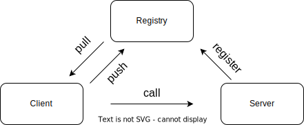
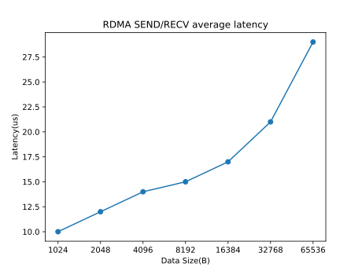

# xRPC

xRPC 是一个轻量级、高吞吐、低延迟的 RPC 框架，能够为支持 RDMA 网络接口的应用提供超低延迟 RPC（5~6us）。本框架支持与 Spring 框架无缝整合，这意味着现有的 Spring 应用可以无缝地集成 xRPC，从而获得更高效、更快速的 RPC 通信，从而进一步提升整体应用性能和用户体验。


## 架构




## 特点

- 面向接口编程，易扩展；
- 采用了大量的设计模式，如单例模式、工厂方法模式、享元模式和代理模式等；
- 支持自动服务注册和发现；
- 支持配置不同的序列化协议、注册中心和负载均衡策略；
- 支持跨语言通信（目前支持 Java、Go 通信）
- 支持与 Spring 框架无缝整合；
- 支持 RDMA 通信协议，可实现极低传输延迟，且对上层应用透明。

> [什么是 RDMA？](https://www.fibermall.com/blog/what-is-rdma.htm)


## 模块

根据不同的角色任务划分为了 5 个模块，分别为 client、server、network、registry 和 common

|     模块      |                         功能                         |                             说明                             |
| :-----------: | :--------------------------------------------------: | :----------------------------------------------------------: |
|  xrpc-client  |         主要用于创建 xRPC 客户端实例和服务桩         | 目前支持 `JDK` 动态代理的方式创建服务桩，后续会添加其他创建方式 |
|  xrpc-server  |     主要用于创建 xRPC 服务端实例和设计请求处理器     |                              -                               |
| xrpc-network  |  主要负责进行网络传输、将请求提交给不同的请求处理器  | 目前支持 `RDMA`、`Netty` 网络传输方式（`RDMA` 功能还待进行测试） |
| xrpc-registry |              主要用于注册和获取服务实例              | 目前支持 `ZooKeeper` 注册中心，后续会添加对其他注册中心的支持 |
|  xrpc-common  | 公共的接口，包括序列化协议、负载均衡策略、SPI 机制等 | 目前支持 `Hessian`、`JSON` 和 `Protostuff` 等序列化方式，支持 `Random`、`RoundRobin` 和 `IPHash` 等负载均衡策略 |


## 案例

**方式一：手动编程**

```java
public class Server {
    private static final Logger logger = LoggerFactory.getLogger(Server.class);

    public static void main(String[] args) throws Exception {
        String host = "127.0.0.1";
        int port = 2181;
        URI registryUri = URI.create("zookeeper://" + host + ":" + port);

        logger.info("创建xRPC服务端实例...");
        XRpcServer server = new XRpcServer(8090, registryUri);

        logger.info("创建服务提供者...");
        HelloService helloService = new HelloServiceImpl();

        logger.info("向RPC框架注册服务提供者...");
        server.addServiceProvider(HelloService.class, helloService);

        logger.info("开始提供服务...");
        server.start();
    }

}
```

```java
public class Client {
    private static final Logger logger = LoggerFactory.getLogger(Client.class);

    public static void main(String[] args) {
        String host = "127.0.0.1";
        int port = 2181;
        URI registryUri = URI.create("zookeeper://" + host + ":" + port);

        logger.info("创建xRPC客户端实例...");
        XRpcClient client = new XRpcClient(registryUri);

        logger.info("创建服务桩...");
        HelloService helloService = client.getRemoteService(HelloService.class, SerializationType.JSON);
        assert helloService != null;

        String name = "World!";
        logger.info("请求服务, name: {}...", name);
        String response = helloService.hello(name);
        logger.info("收到响应: {}.", response);
    }

}
```

**方式二：与 Spring 整合**

```java
public class Server {

    private static final Logger logger = LoggerFactory.getLogger(Server.class);

    public static void main(String[] args) {
        ApplicationContext applicationContext = new ClassPathXmlApplicationContext("spring-server.xml");
    }

}
```

```java
public class Client {

    public static void main(String[] args) {
        ApplicationContext applicationContext = new ClassPathXmlApplicationContext("spring-client.xml");
        HelloController controller = applicationContext.getBean(HelloController.class);
        controller.say();
    }

}
```

```java
@Component
public class HelloController {

    private static final Logger logger = LoggerFactory.getLogger(Client.class);

    @RpcReference(loadbalance = "roundrobin", serialize = "json")
    private HelloService helloService;

    public void say() {
        String name = "World!";
        logger.info("请求服务, name: {}...", name);
        String response = helloService.hello(name);
        logger.info("收到响应: {}.", response);
    }

}
```


## 测试

**配置**

- RDMA NIC: ConnectX-3
- CPU: Intel(R) Xeon(R) Gold 6230 CPU @ 2.10GHz 
- OS: CentOS Linux 7
- GCC: 10.1.0




## 支持

本项目的其他语言支持

- **[xrpc-go](https://github.com/yj8023xx/xrpc-go)**


## 参考资料

- **[NettyRpc](https://github.com/luxiaoxun/NettyRpc)**
- **[simple-rpc-framework](https://github.com/liyue2008/simple-rpc-framework)**
- **[darpc](https://github.com/zrlio/darpc)**
